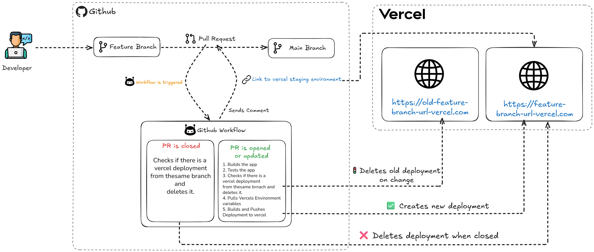
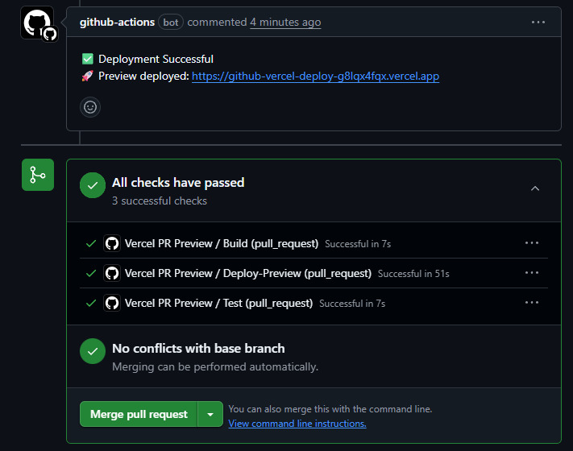

# Preview Deployment Pipeline with GitHub Actions & Vercel

> Automate, test, preview, and clean up with zero manual effort.

This project sets up an automated CI/CD workflow using **GitHub Actions** to streamline frontend development. It ensures that every Pull Request gets its own staging environment on **Vercel**, complete with preview links, automated checks, and graceful teardown.

---

## 🔧 What It Does

- Runs build and test checks on each PR push
- Deletes any previous preview deployments for the PR
- Deploys a fresh staging instance to Vercel
- Comments the deployment URL directly in the PR
- Cleans up the deployment once the PR is closed

---

## ✨ Why It’s Useful

- Instant feedback for reviewers
- Eliminates stale preview clutter
- Reduces human error in deployments
- Works great in team settings with multiple simultaneous PRs

---

## 📽️ Inspiration

This project was inspired and initially forked from [this YouTube video](https://youtu.be/FHVaWZjWec4) which lays the groundwork for dynamic Vercel preview deployments. I’ve extended it with improved logic for build/test validation and cleaner deployment lifecycle handling.

---

## 💡 Tech Stack

- GitHub Actions (CI/CD automation)
- Vercel (preview environments)
- JavaScript/Node.js frontend projects (customizable)

---

## 🛠️ Setup

1. **Fork this repo**  
2. **Update Vercel tokens/secrets** in your GitHub repo settings
3. **Customize the workflows** in `.github/workflows/` to fit your project's needs
4. Push a PR and watch it deploy

---

## 📂 Workflows

- `deploy-preview.yml`: Handles build, test, deploy, and PR commenting  
- `remove-preview.yml`: Deletes Vercel deployment when PR is closed

---

## 🙌 Contributions

Feel free to fork and improve on this. PRs are always welcome!
